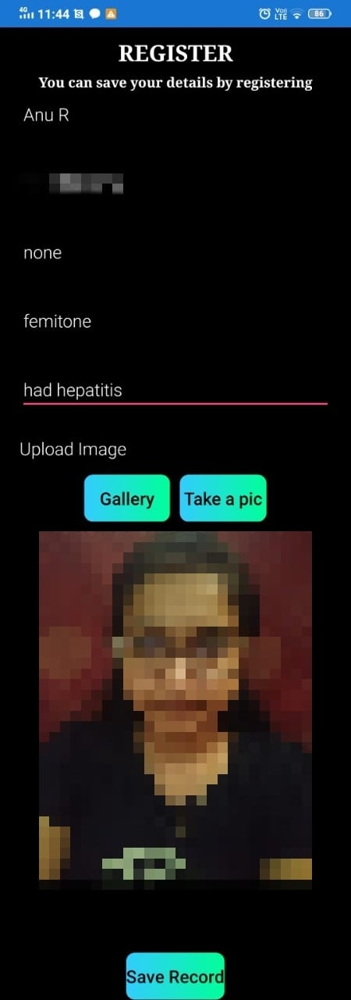
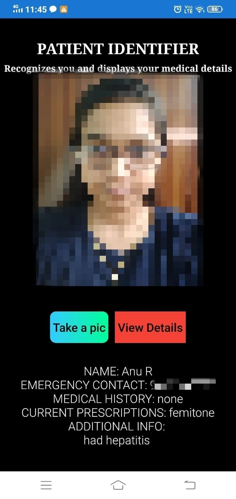

# Person_and_Psychological_states_Identification

### Problem Definition:

To get the medical records of the patient using face identification technology in an emergency situation (accidents in roads) and also to detect signs of depression and to classify levels of depression (high,mild,normal).

### Project Guide: 

Dr.T Senthil Kumar, Asst. Professor, CSE, Amrita School of Engineering.

### Team:
 1. Anu Bharathy R - CB.EN.U4CSE17206
 2. B Navya Krishna - CB.EN.U4CSE17317
 3. M Vinith - CB.EN.U4CSE17335

### System Design:

Our application is solely built on the purpose to help patients with medical records who meet with emergency situations where they require immediate first aid based upon their medical record history and are unable to communicate efficiently and to detect irregularities w.r.t. the facial expressions.
Our proposed Mobile Application uses **MTCNN** for face detection, **Facenet** for Face Identification and **CNN** for detecting depression via facial expression to obtain a output without compromising on accuracy and memory.

### Screenshots of the application:

#### Registration Module:

#### Identification Module:

#### Depression Detection Module:

 

### Results:

The **Accuracy** of Face Identification is 98% as we have tested with 50 images with various backgrounds, illuminations etc and for Depression Detection , we ran it through the FER-2013 dataset. 
The **Runtime** largely depends on the internet connectivity of the particular person as the database in both the modules are connected with the Firebase.
The **Space complexity**, is reduced by deleting the image being stored as soon as the features are extracted.

### Conclusion:

Our Mobile Application implements a system which registers the patient’s details, identifies his/her face and displays the medical details, and detect the depression of the person. The implemented methods, results, and analysis are valid for android phones with version greater than Lollipop (5.0).
In future, the runtime of the application can be reduced by giving medical results of patient to user as soon as possible. Size of the application can be reduced by making heavy algorithms run in cloud and making application lighter as possible. Database
security can be increased to protect the records of the patients.
